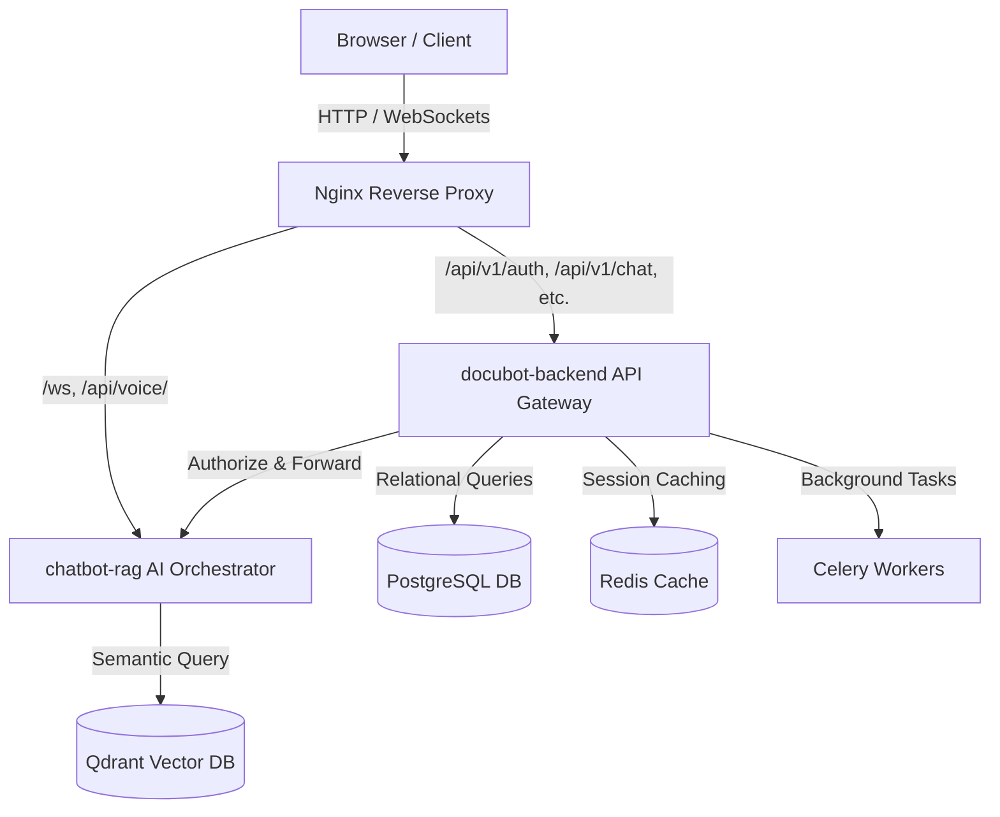
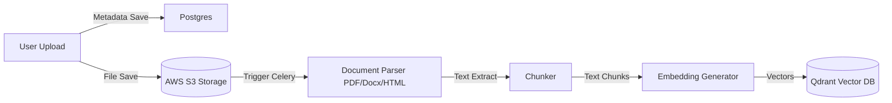
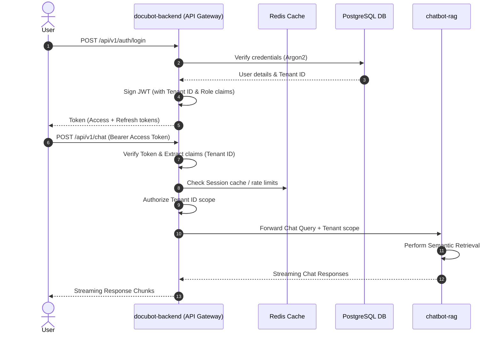
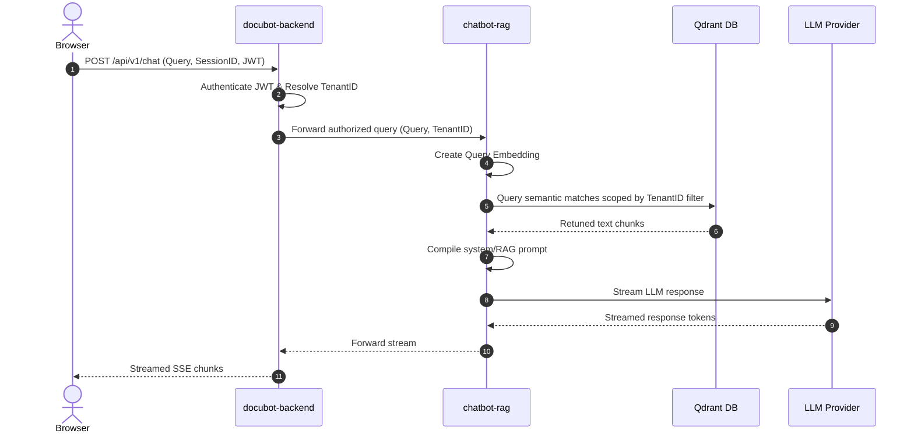
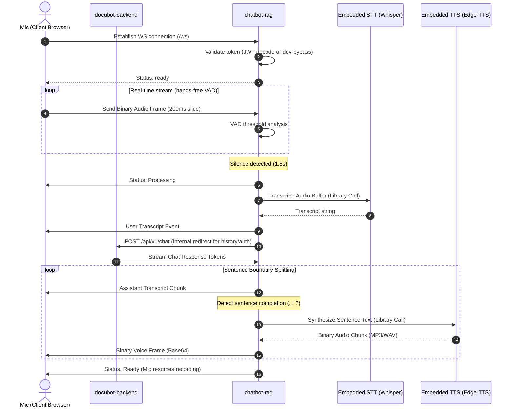

# DocuBot Platform — Production Architecture Specification

This document details the production architecture, system design, service boundaries, data flows, and security specifications for the DocuBot Voice RAG platform.

> **Last updated**: July 2026 — reflects fullscreen ChatGPT-style voice UI, AudioQueue AnalyserNode integration, and chat route payload normalisation.

---

## 1. System Topology & Service Boundaries

### A. docubot-backend (API Gateway & Business Logic)
- **Role**: Edge gateway, auth controller, database coordinator.
- **Responsibilities**:
  - Authentication (JWT issuance and verification, Argon2 password hashing).
  - RBAC (Role-Based Access Control) & Tenant Resolution.
  - Rate Limiting (Redis-based sliding window).
  - Chat Session Management & Conversation History Storage.
  - Document metadata ownership, upload authorisation (S3 presigned URLs), and relational database storage.
  - Client-facing REST endpoints (`/api/v1/auth`, `/api/v1/sessions`, `/api/v1/messages`).
  - **Dev bypass**: Accepts `mock-guest-token` as a valid guest credential (see `app/auth/security.py`).

### B. chatbot-rag (AI-Only Orchestration Service)
- **Role**: High-performance, AI-specific processing engine.
- **Responsibilities**:
  - WebSocket Streaming gateway (`/ws`) for voice sessions.
  - Embedded Voice Services (Whisper STT via Groq, Edge-TTS) to eliminate extra network hops.
  - Embedding generation, prompt building/compiling, and LLM orchestration.
  - Semantic vector retrieval from Qdrant.
  - **No business logic ownership**: Relies on docubot-backend for user validation.
  - **Dev bypass**: Accepts `mock-guest-token`, `mock-tech`, `mock-health` without JWT decode (see `websocket/connection.py`).

### C. docubot-frontend (Next.js 16 UI)
- **Role**: Browser client — chat interface and voice session controller.
- **Responsibilities**:
  - Chat message streaming via AI SDK `DefaultChatTransport`.
  - **Fullscreen Voice Interface** (`VoiceInterface.tsx`) — ChatGPT-style gradient orb that pulses in real time with both mic input (user) and `AudioQueue.getVolumeLevel()` (assistant).
  - `AudioQueue` — gapless playback via scheduled `AudioBufferSourceNode` timeline with an `AnalyserNode` wired into the graph to expose live volume levels.
  - `/api/chat` route normalises two SDK payload shapes (`{message}` and `{messages}`) before forwarding to `docubot-backend`.

---

## 2. Ingestion, Authentication, and Lifecycles

### Document Ingestion Pipeline

### Knowledge Base Lifecycle States
1. **Upload**: Document is uploaded to S3; metadata is written to PostgreSQL as `processing`.
2. **Processing**: Celery parses, chunks, and generates embeddings.
3. **Indexed**: Chunks are written to Qdrant. PostgreSQL updates state to `indexed`.
4. **Active**: The document is approved and available for search queries.
5. **Archived**: Excluded from active searches but preserved in storage.
6. **Deleted**: Soft-deleted (flagged in DB) then hard-deleted (removed from Postgres, S3, and Qdrant).

### Authentication & Tenant Resolution Flow

---

## 3. End-to-End Sequence Diagrams

### Text Chat Flow

### Voice Streaming Flow (WebSocket)

---

## 4. API Versioning, Failures, and Tenant Isolation

### API Versioning Policy
- `/api/v1` remains backward compatible during a major release cycle.
- Breaking changes require a new version prefix (e.g. `/api/v2`).
- Deprecated endpoints remain available for exactly one major release cycle.

### Retry & Failure Policies
- **LLM Provider Timeout**: Retry once; if it fails again, log error and return an error message to the client.
- **Qdrant Offline**: Fallback to database-level keyword RAG search (`kb_documents` query in PostgreSQL) or return an empty context with a warning log.
- **STT Failure**: Notify the client via WebSocket JSON message (`type: "error"`) and keep the session active so the user can try speaking again.
- **TTS Failure**: Return text-only response to the client (omit binary audio frames), logging the synthesizer issue.
- **Redis Offline**: Fallback to direct PostgreSQL queries for session lookup, operating without cache where safe.

### Tenant Isolation Rules (Defense-in-Depth)
Tenant isolation is enforced programmatically at all layers:
- **PostgreSQL**: Queries enforce `WHERE tenant_id = :tenant_id` scopes.
- **Qdrant**: All search and retrieval payloads filter by `{"tenant_id": "tenant-slug"}`.
- **S3 Storage**: Files are structured under `/tenants/{tenant_id}/documents/`.
- **Redis Cache**: Keys are prefixed with `tenant:{tenant_id}:session:{session_id}:`.
- **WebSocket**: Active connections validate tenant ID claims extracted from the initial JWT.

---

## 5. Performance, Observability, and DR

### Performance Targets
- **First Token Latency**: < 1.0 seconds (LLM stream start).
- **STT Processing Latency**: < 500 ms for normal utterances (< 5 seconds of audio).
- **Voice Response Synthesize (TTS)**: Synthesize first sentence < 400 ms.
- **WebSocket Reconnection**: Auto-reconnect < 2.0 seconds.
- **Concurrency**: Scale to support 100+ concurrent real-time voice sessions.
- **API Health Check Probe**: Response < 100 ms under normal load.

### Monitoring Metrics
The system collects and exports the following metrics:
- Request latency (HTTP endpoints)
- Token generation latency (tokens/sec)
- STT transcription duration
- TTS speech synthesis duration
- Active WebSocket connections count
- Active conversational sessions count
- Qdrant vector search retrieval latency
- LLM token usage (input/output counts)
- Celery worker queue depth

### Backup & Disaster Recovery (DR)
- **PostgreSQL**: Automated daily incremental backups with a 30-day retention policy.
- **Qdrant**: Weekly vector snapshot schedules uploaded to secure, isolated S3 backup locations.
- **S3 Storage**: S3 bucket versioning enabled. Replication to secondary AWS regions for failover.
- **Redis Recovery**: Redis AOF (Append Only File) persistence enabled for session durability.
- **RTO/RPO Targets**: Recovery Time Objective (RTO) < 4 hours; Recovery Point Objective (RPO) < 24 hours.
