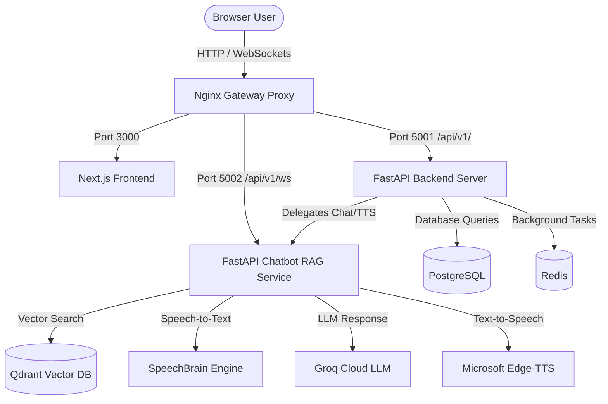

# DocuBot: Multi-Tenant RAG Voice Chatbot Platform

DocuBot is a state-of-the-art AI assistant system that allows users to interact with company documents and files using both text chat and real-time voice conversations. 

The platform is designed to be **multi-tenant**, meaning multiple different organizations (tenants) can use the same server infrastructure while keeping their user databases, login credentials, and stored documents strictly separate and secure.

---

## Key Features

1. **Multi-Tenant Document RAG (Retrieval-Augmented Generation)**:
   - Users upload files (PDFs, text, Word docs) to their tenant's database.
   - When a user asks a question, the system retrieves only the relevant information from *their organization's* uploaded documents (scoping retrieval to the active `tenantId`).
   
2. **Real-time Voice Gateway**:
   - Allows users to talk to the AI using their microphone.
   - Converts the spoken words to text (Speech-to-Text).
   - Generates an AI text response using relevant retrieved documents.
   - Speaks the answer back to the user in real-time (Text-to-Speech).
   - **Barge-in Support**: Users can interrupt the AI while it's speaking just by talking, causing the assistant to stop speaking and listen immediately.
   - **Play message aloud**: An on-demand "Speak" option sits below text messages in the chat history, allowing users to listen to any response individually.

3. **Secure Authentication**:
   - Integrated JWT (JSON Web Token) authentication layer.
   - The token contains organization identifiers (`tenantId`) and user context, securing every REST API call and WebSocket session.

---

## System Architecture

DocuBot is built as a set of microservices orchestrated using Docker:

### Components
*   **Next.js Frontend (Port 3000)**: A React-based web dashboard that provides the chat interface, voice hub control, session list, and settings.
*   **API Gateway Backend (Port 5001)**: Handled by FastAPI. Manages user accounts, authentication tokens, message/session storage, and routes request traffic.
*   **Chatbot RAG Service (Port 5002)**: Handled by FastAPI. Contains the core logic for ASR (SpeechBrain), Vector Database operations (Qdrant), LLM orchestration (Groq), and Audio synthesis (Edge-TTS).
*   **PostgreSQL**: Secure relational database storing user records, metadata, tenant definitions, and chat message history.
*   **Redis**: Key-value cache and Celery broker for async background indexing tasks.
*   **Qdrant Vector Database**: Storing document chunk embeddings to perform highly efficient multi-tenant context retrieval.
