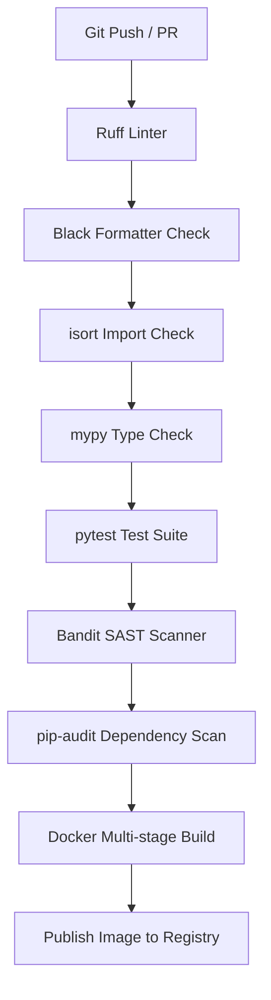

# DocuBot Platform Release Validation Plan (v1.0.0)

This plan defines the shift from feature implementation to release validation, outlining the testing, load, security, disaster recovery, and operational procedures required to confirm production-readiness.

## 1. CI/CD Pipeline Definition
Every push or pull request to the main branch must successfully pass the following automated pipeline stages:

## 2. Health & Readiness Endpoint Verification
The `/health`, `/ready`, and `/live` endpoints inside the API Gateway (`docubot-backend`) must report granular dependency statuses:
- **Liveness (`/live`)**: Reports basic service uptime.
- **Readiness (`/ready`)**: Performs active pings to downstream resources:
  - **PostgreSQL**: Checks active pool connection.
  - **Redis**: Checks ping-pong response.
  - **Qdrant**: Verifies cluster health API status.
  - **Celery**: Asserts that active worker nodes are registered.
  - **LLM/STT/TTS API**: Validates API connectivity with downstream cloud endpoints (if not in mock mode).

## 3. Web Audio & Browser Compatibility
For voice functionalities, validation must be completed across target platforms:
- **Browsers**: Google Chrome, Microsoft Edge, Mozilla Firefox, and Apple Safari.
- **Audits**:
  - **Microphone Permissions**: Graceful handle of user denial/block.
  - **Autoplay Policies**: User interaction gate (e.g., "Start Conversation" button click) to initialize audio context.
  - **Web Audio API**: PCM buffer chunk compatibility and downsampling checks (converting browser mic input to 16kHz mono).

## 4. Operational & Resiliency Scenarios
- **WebSocket Robustness**:
  - Verification of automatic reconnection under momentary drop.
  - Rejection of invalid/expired JWT tokens on startup.
  - Mitigation of duplicate session concurrency (closing older connections when new browser tab connects).
  - Enforced idle timeout (closing idle sockets after 10 minutes of inactivity).
- **Celery Worker Resiliency**:
  - Retry parameters configured with exponential backoff for external calls.
  - Dead-letter queues configured for unparsable files.
  - Database locks/uniqueness constraints to prevent duplicate indexing tasks.
- **Observability**:
  - Request IDs propagated through headers (`X-Request-ID`).
  - Correlation of HTTP request logs, Celery task logs, and WebSocket voice session frames.
- **Resource Monitoring Guidelines**:
  - Track CPU, Memory, Redis load, PostgreSQL pool connection state, and Celery queue backlog depth during stress tests.

## 5. Security & Production Configuration Checklist
Before release, verify:
- [ ] Environment variable `ENVIRONMENT` set to `production`.
- [ ] Debug logging and exception traceback display disabled in client responses.
- [ ] JWT keys replaced with high-entropy keys managed by secret vaults.
- [ ] Default passwords for database, Redis, and Qdrant modified.
- [ ] Mock provider modes (`mock` LLM/STT/TTS) disabled.
- [ ] CORS allowed origins configured to specific production domains.
- [ ] HTTPS and WSS enforced via Nginx proxy redirects.

## 6. Release Acceptance Criteria (Gates)
A release may be tagged `v1.0.0` only if all the following gates are met:
1. **Automated Verification**: 100% of unit, integration, and security checks (`pytest`, `Bandit`, `pip-audit`) pass.
2. **E2E Validation**: Flow checks succeed (Upload -> Parse -> Vector search query -> Voice session stream -> Document delete).
3. **Multi-Tenant Scoping**: Script validation confirms zero leakage of cross-tenant indexes.
4. **Load Testing**: Response latencies meet target metrics under 100 concurrent loads.
5. **Rollback Testing**: Complete verification of database migrations and service downgrades from v1.0.1 to v1.0.0.
6. **Sign-off**: Formal approval from technical lead.
